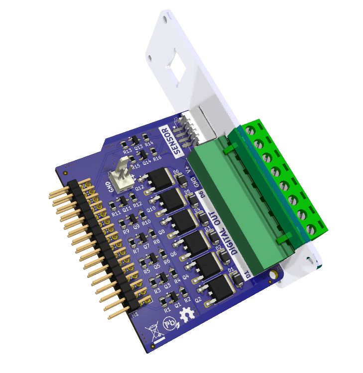

The Edgeberry **Sense'n'Drive Hardware Cartridge** expands your project's capabilities with 6 digital outputs and an I2C sensor port.

 

## License & Collaboration
**Copyright© 2024 Sanne 'SpuQ' Santens**. This project is released under the **CERN OHL-W** license. The [Rules & Guidelines](https://github.com/Edgeberry/.github/blob/main/brand/Edgeberry_Trademark_Rules_and_Guidelines.md) apply to the usage of the Edgeberry™ brand.

### Collaboration

If you'd like to contribute to this project, please follow these guidelines:
1. Fork the repository and create your branch from `main`.
2. Make your changes and ensure they adhere to the project's design style and conventions.
3. Test your changes thoroughly.
4. Ensure your commits are descriptive and well-documented.
5. Open a pull request, describing the changes you've made and the problem or feature they address.
